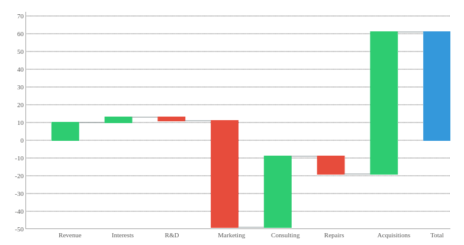

  

  

# React Waterfall Chart

  

<a  href="https://www.npmjs.com/package/react-waterfall-chart"></a>  <a  href="https://www.npmjs.com/package/react-waterfall-chart"  ></a>  <a  href="https://github.com/KeyValueSoftwareSystems/react-waterfall-chart"></a>

  

<div  align="center">

</div>

  

>A customizable & responsive Waterfall chart for react project

  

Try tweaking a waterfall chart using this codesandbox link <a  href="https://codesandbox.io/s/waterfall-chart-example-uvr8jd">here</a>

  

## Installation

  

The easiest way to use react-waterfall-chart is to install it from npm and build it into your app with Webpack.

  

```bash

npm install  @keyvaluesystems/react-waterfall-chart

```

You’ll need to install React separately since it isn't included in the package.  

## Usage

React Waterfall chart can run in a very basic mode by just providing the `transactions` like given below:

  

```jsx

import  WaterfallChart  from  '@keyvaluesystems/react-waterfall-chart';

<WaterfallChart
  transactions={transactionList}
/>

```

  

The transactions prop is an array of transactions with the following keys:

  

-  `label` - a string to represent each transaction

-  `value` - a number that specifies the transaction quantity

- `color` - the color preference for each transaction. (optional)

An example for transactions array is shown below:

  

```jsx
const  transactionsList = [
	{
		label:  'Quarter 1, 2020',
		value:  1000,
		color: 'red'
	},
	{
		label:  'Quarter 2, 2020',
		value:  -500
	}
]
```

You can use `barWidth` prop to specify the width of each bar present in the chart. The given value will be converted to pixels (px) and applied to the chart.
With the help of `showBridgeLines` prop, the line connecting the adjacent bars can be shown/hidden.
`showFinalSummary` can be used to display the summary as the last transaction.
 
```jsx
<WaterfallChart
 transactions={transactionsList}
 barWidth={100}
 showBridgeLines={true}
 showFinalSummary={false}
/>
```

  

You can specify whether to show or hide the scale lines in the Y axis with the help of `showYAxisScaleLines` prop.

```jsx
<WaterfallChart
 transactions={transactionsList}
 showYAxisScaleLines={true}
/>
```
## Props

  Props that can be passed to the component are listed below:

<table>
<thead>
<tr>
<th>Prop</th>
<th>Description</th>
<th>Default</th>
</tr>
</thead>
<tbody>
<tr>
<td><code><b>transactions:</b> object[]</code></td>
<td>
An array of transaction objects to specifying the value, label and color preference
</td>
<td><code>[]</code></td>
</tr>
<tr>
<td><code><b>barWidth?:</b> number</code></td>
<td>
A number to specify the width of each bars shown in the chart
</td>
<td><code>true</code></td>
</tr>
<tr>
<td><code><b>showBridgeLines?:</b> number</code></td>
<td>
A boolean value to specify whether to show the connecting line between adjacent bars
</td>
<td><code>true</code></td>
</tr>
<tr>
<td><code><b>showYAxisScaleLines?:</b> boolean</code></td>
<td>
The boolean value to control the display of scale lines in y axis
</td>
<td><code>true</code></td>
</tr>
<tr>
<td><code><b>yAxisPixelsPerUnit?:</b> number</code></td>
<td>
The distance between each y axis scale unit. The value specified will be applied as pixels.
</td>
<td><code>0</code></td>
</tr>
<tr>
<td><code><b>showFinalSummary?:</b> boolean</code></td>
<td>
The boolean value to control the display of summary section. The summary will be displayed as the last transaction
</td>
<td><code>true</code></td>
</tr>
<tr>
<td><code><b>summaryXLabel?:</b> string</code></td>
<td>
The x axis label to be shown for the summary section.
</td>
<td><code>Summary</code></td>
</tr>
<tr>
<td><code><b>onChartClick?:</b> function</code></td>
<td>
The callback function which will be triggered on clicking the bars in the waterfall chart. The current bar element will be passed as the prop in the function
</td>
<td><code>undefined</code></td>
</tr>
<tr>
<td><code><b>styles?:</b> object</code></td>
<td>
Provides you with a bunch of callback functions to override the default styles.
</td>
<td><code>undefined</code></td>
</tr>
</tbody>
</table>


## Style Customizations


All the default styles provided by this package are overridable using the `style` prop.
the below code shows all the overridable styles:

```jsx
<WaterfallChart
 transactions={transactionsList}
 showYAxisScaleLines={true}
 styles={{
	 summaryBar: CSSProperties,
	 positiveBar: CSSProperties,
	 negativeBar: CSSProperties
 }}
/>
```
-  `summaryBar` - overrides the summary bar styles
-  `positiveBar` - overrides the positive value bar styles
-  `negativeBar` - overrides the negative value bar styles
